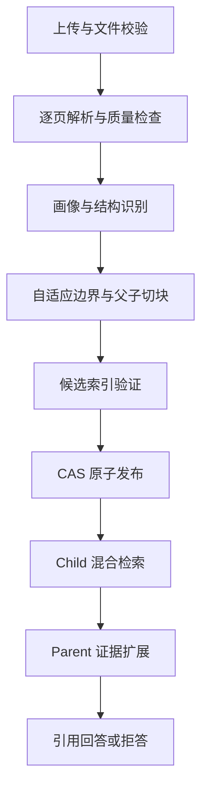

# Enterprise Trusted Adaptive Chinese RAG V4

V4 是面向企业说明书、法规、技术文档、论文和通用中文资料的生产可信 RAG 工程。它同时解决两类问题：生产生命周期必须正确，进入索引并被回答系统使用的证据必须完整、可解释、可复现。

## 核心目标

- 生产可信化：文档删除 fencing、任务取消与租约、索引候选验证、CAS 原子发布、硬超时、租户 ACL、JWT/可信代理认证、非 root 容器。
- RAG 准确率强化：逐页解析与 OCR 质量门、内容画像、中文结构树、自适应边界评分、Parent-Child Chunk、中文 BM25 与向量混合检索、RRF、重排、证据预算、精确引用和结构化拒答。

系统采用显式 Python 状态机和模块化端口/适配器，不依赖多 Agent 或工作流框架。检索只命中精确 Child，回答阶段在预算内扩展 Parent，引用始终回到命中的 Child。

## 处理与问答链路



## 本地启动

要求 Python 3.11、[uv](https://docs.astral.sh/uv/)，以及可选的 Ollama、Tesseract。

```bash
uv sync --frozen --extra dev --extra local-models
cp .env.example .env
uv run python scripts/init_db.py --content-profile general_prose
```

分别启动 API、Worker 和 UI：

```bash
ENTERPRISE_RAG_ENV=development uv run uvicorn enterprise_rag.api.main:app --reload
ENTERPRISE_RAG_ENV=development uv run python scripts/run_worker.py
ENTERPRISE_RAG_ENV=development uv run streamlit run src/enterprise_rag/ui/streamlit_app.py
```

- API 与 OpenAPI：<http://127.0.0.1:8000/docs>
- UI：<http://127.0.0.1:8501>
- Liveness：<http://127.0.0.1:8000/api/v1/health/live>
- Readiness：<http://127.0.0.1:8000/api/v1/health/ready>

开发配置只允许在本机使用 Demo 身份。默认 LLM 端点为 `http://localhost:11434/v1`，模型为 `qwen3:8b`；可以通过 `.env` 中的嵌套环境变量覆盖。

扫描 PDF 需要额外安装：

```bash
uv sync --frozen --extra dev --extra local-models --extra ocr
```

同时安装系统 Tesseract 中文/英文语言包，并设置 `ENTERPRISE_RAG__OCR__ENABLED=true`。

## Docker 启动

本机开发：

```bash
docker compose -f compose.dev.yml up --build
```

生产示例使用 JWT，API 仅暴露在 Compose 内部网络，外部请求经 Nginx：

```bash
export ENTERPRISE_RAG_JWT_SECRET='replace-with-a-long-random-secret'
docker compose up --build -d
```

生产凭据应由密钥管理系统注入，不应写入 `.env`、镜像或仓库。生产部署、JWT 声明和代理要求见 `docs/DEPLOYMENT.md` 与 `docs/SECURITY.md`。

## 质量门禁

```bash
uv run ruff check src tests scripts
uv run mypy src
uv run pytest
uv pip check --python .venv/bin/python
uv lock --check
```

含 FAISS、OCR、Ollama 和 Docker 的验收需要相应本地运行时。发布前还必须在固定中文评测集上比较候选报告，确保 Recall@K、MRR、nDCG、引用正确率和拒答准确率不回退，并保证硬边界违反为零、重复切块完全一致。

## 工程导航

- `docs/ENGINEERING_DESIGN.md`：总体架构、状态机和可信边界。
- `docs/ADAPTIVE_CHUNKING.md`：自适应边界公式、硬/软边界、Parent-Child 算法。
- `docs/PROJECT_STRUCTURE.md`：目录、源文件职责和关键函数。
- `docs/API.md`：HTTP API、认证和示例。
- `docs/SECURITY.md`：认证、授权、租户隔离和威胁边界。
- `docs/DEPLOYMENT.md`：本地、Docker、生产启动与运行检查。
- `docs/EVALUATION.md`：固定评测集、指标和候选发布门禁。
- `docs/IMPLEMENTATION_STATUS.md`：当前实现与仍需外部运行时验证的项目。
