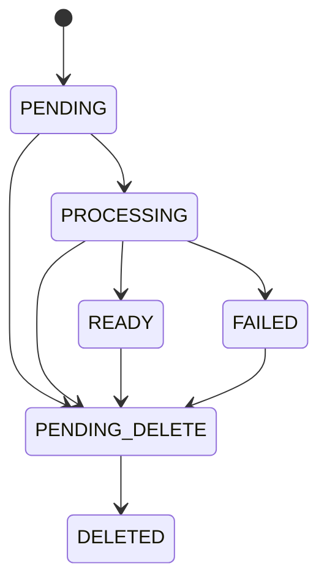
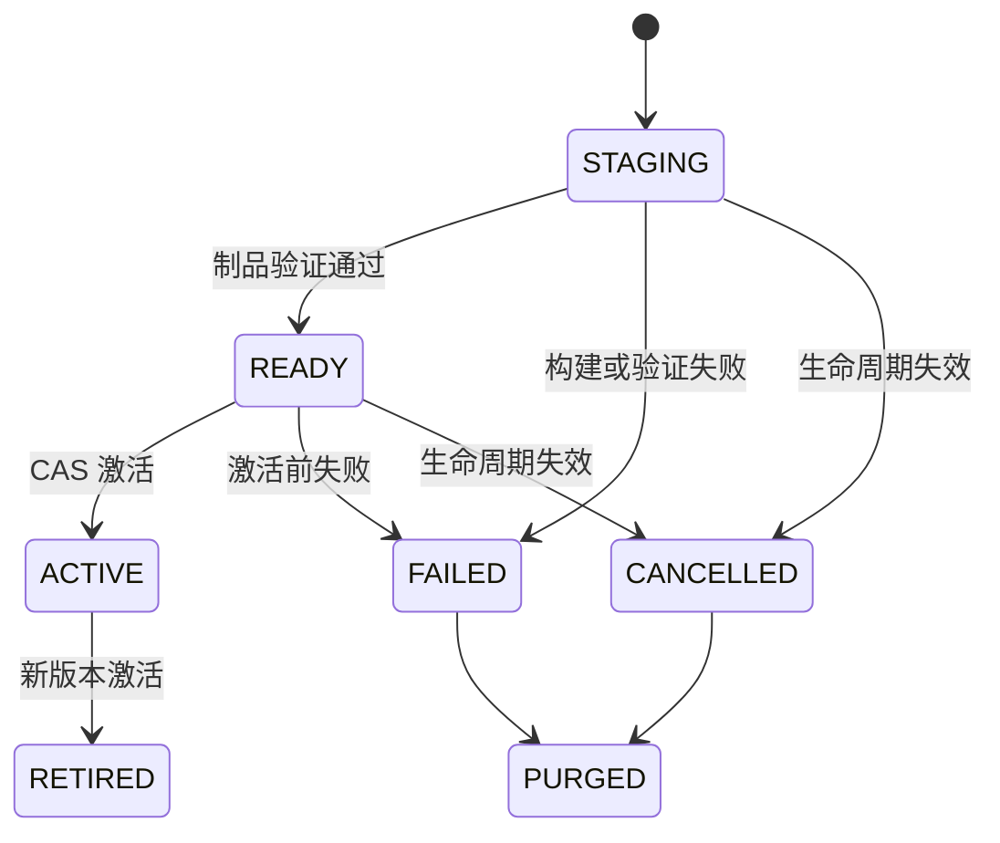

# V4 工程设计

## 定位与边界

V4 的正式定位是 **Production-Trusted Adaptive Chinese RAG**。系统服务单体部署下的企业知识库场景，以不可变文档版本和不可变索引快照为主线。当前不引入多 Agent、微服务拆分或强制远程向量数据库。

## 分层架构

| 层 | 职责 | 关键约束 |
|---|---|---|
| API/UI | 请求校验、认证、响应模型 | 不直接访问索引和数据库 |
| Services | 文档、任务、索引、问答用例 | 事务边界与租户边界显式 |
| Domain/Core | 状态、模型、协议、异常、预算 | 不依赖 Web 与具体存储 |
| Ingestion | 解析、OCR、结构、切块、质量门 | 不完整结果不得发布 |
| Indexing/Retrieval | 不可变索引、混合召回、证据组装 | 请求固定一个活动版本 |
| Infrastructure | SQL、文件、模型、OCR、FAISS | 通过协议注入并可替换 |
| Evaluation/Observability | 指标、对比、Trace | 记录指纹且不泄露正文 |

## 文档生命周期

`Document.lifecycle_generation` 是删除 fencing token。任务创建时把它冻结到 `IngestionJob.document_generation_snapshot`。删除事务递增 generation、取消排队任务并对运行任务设置取消请求。Worker 每个持久化和发布边界同时检查任务租约、attempt token、取消标记、文档状态和 generation；旧 Worker 因此无法把删除中的文档写回 `READY`。

## 索引发布状态机

同一个 `IndexBuildPlan` 同时生成向量索引、BM25 和 Source Catalog。候选目录写完后校验 Manifest、文件哈希、Chunk 数量和重新加载能力。数据库以期望活动版本执行 CAS；冲突时不覆盖其他发布者。候选失败不改变旧活动版本，失败状态和完成时间必须收口。

## 文档版本与可复现性

`DocumentVersion` 冻结以下信息：内容画像与置信度、切块策略 ID/版本、全部边界参数、Embedding 指纹、Tokenizer ID、解析流水线版本和可选边界模型指纹。稳定 Chunk ID 由租户、文档版本、顺序、内容哈希和切块器版本共同生成。相同输入与快照必须产生相同顺序、哈希和父子映射。

## 请求内可信问答

1. 从已验证身份构造租户和 Source ACL。
2. 固定请求开始时的活动索引版本。
3. 路由候选 Source，并与 ACL 求交集。
4. Child 执行向量与 BM25 召回，通过 RRF 融合和可选重排。
5. 去除同 Parent 重复证据，限制单文档占比，按分数断层选择 Child。
6. 在 Token 预算内加载 Parent 上下文，但保留 Child 引用身份。
7. 证据不足时最多执行受预算约束的查询改写。
8. 生成后校验引用存在性、权限、版本和声明支持；失败则结构化拒答。

## 硬超时

`DeadlineBudget` 使用单调时钟保存全局截止点。在检索、改写、生成和引用验证的调用前后检查；剩余时间传入支持超时参数的模型提供方。外部调用即使迟到返回，结果也会在使用前丢弃，并转换为 `AGENT_DEADLINE_EXCEEDED`，不能伪装为“无证据”。

## 错误与降级原则

- 向量或 BM25 单路故障可以显式降级，双路故障属于系统错误。
- OCR 缺页、Chunk 严重碎片化、父子关系断裂和超长 Chunk 阻止发布。
- 内容画像低置信度回退 `general_prose`，记录置信度和策略。
- LLM 边界复核仅处理模糊分数带；调用失败或预算耗尽使用确定性决策并留痕。
- 超时、权限、处理中、OCR 待处理和证据不足使用不同稳定原因码。
